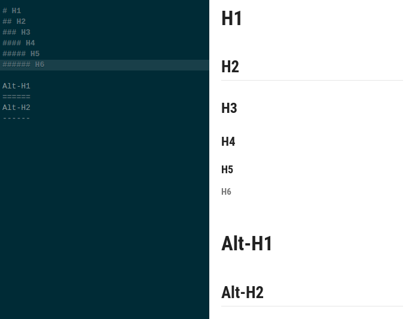
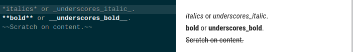
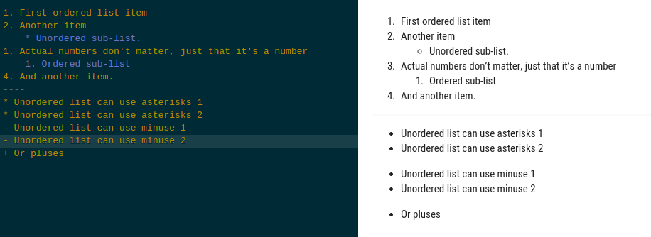
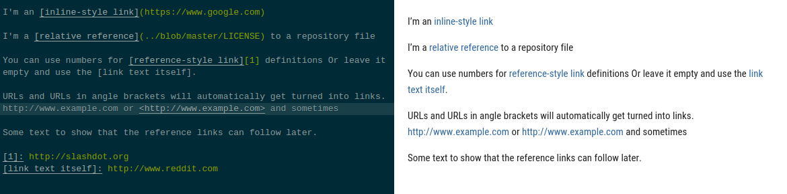
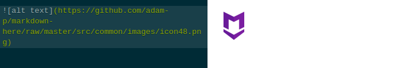
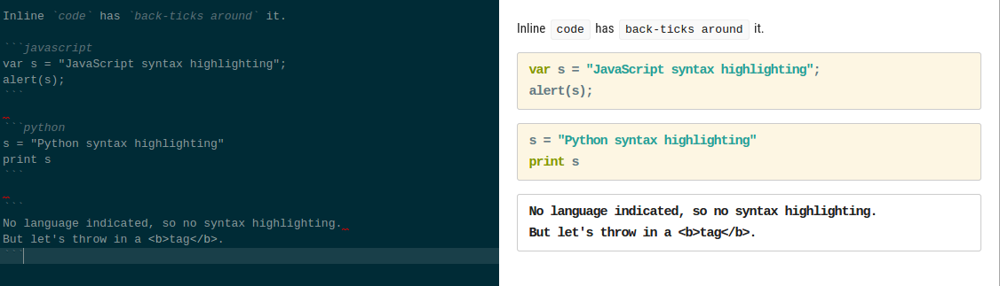
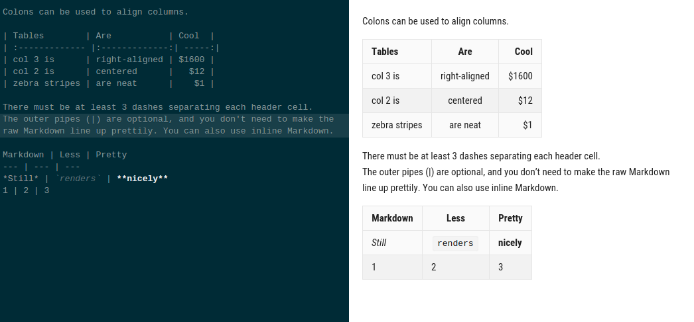
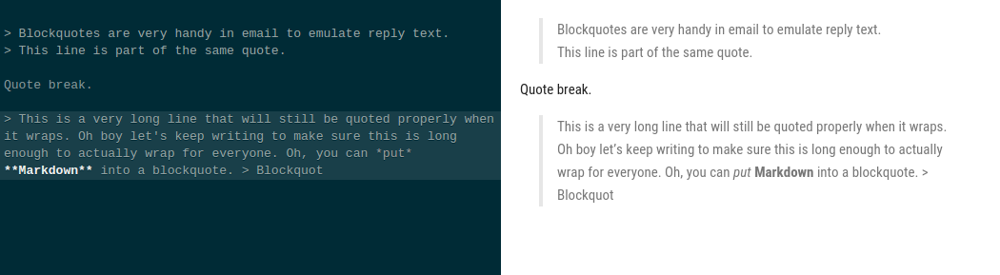

# Documentation
---

# Documentation
* Why we use documentation?

---

# Documentation
* What tools that we have for?
  * Word
  * `Markdown`
  * wiki
  * confluence
  * etc
  
---

# Markdown 
### What it is?

Markdown is a **lightweight markup language** with plain text formatting syntax.
It is designed so that it can be converted to **HTML** and **many other formats** using a tool by the same name.[wiki](https://en.wikipedia.org/wiki/Markdown)

---

### Header

---

### Emphasis

---

### Lists

---

### Links

---

### Images

---

### Code

---

### Tables

---

### Blockquotes

---

### Markdown has multiple versions
 - Github
 - ...
 
---

## Draw Diagrams With Markdown

---

## Draw Diagrams With Markdown

to see more you can go to [this link](https://support.typora.io/Draw-Diagrams-With-Markdown/)

---

## Samples
* [Advance markdown tool](https://mdp.tylingsoft.com/)
* [Markdown presentation](https://www.neomobili.com/products/slidium-markdown-presentation/)
* [conflunce plugin](https://marketplace.atlassian.com/apps/1214124/mermaid-plugin-for-confluence?hosting=server&tab=overview)

